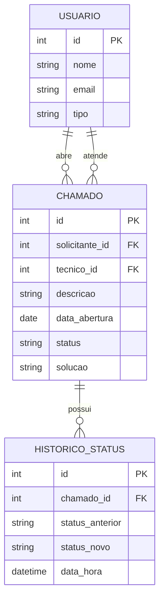

# Sistema de Gestão de Chamados de TI (Helpdesk)

Projeto pessoal de análise e desenvolvimento de sistema, conduzido do zero para aplicar na prática os conhecimentos de Análise de Sistemas e Gestão de Projetos de TI.

O sistema permite que funcionários abram chamados de suporte técnico e acompanhem seu andamento, enquanto a equipe técnica gerencia e resolve as solicitações de forma estruturada.

## Status do projeto

🚧 Em desenvolvimento — Sprint 1 em andamento

## Sobre o projeto

Este projeto cobre o ciclo completo de desenvolvimento de software, desde o levantamento de requisitos até a implementação:

- **Levantamento de requisitos** — documento com requisitos funcionais (RF01-RF06) e não-funcionais
- **Modelagem de dados** — Modelo Entidade-Relacionamento (ER)
- **Planejamento ágil** — backlog do produto com histórias de usuário priorizadas, organizado em sprints, acompanhado via board Kanban
- **Desenvolvimento** — implementação em Java com Spring Boot e PostgreSQL

A documentação completa de requisitos e modelagem está disponível em [`/docs`](./docs).

## Funcionalidades

- [ ] Abertura de chamados técnicos por funcionários
- [ ] Listagem e consulta de status dos chamados
- [ ] Atualização de status pela equipe técnica
- [ ] Registro de solução ao encerrar um chamado
- [ ] Histórico de mudanças de status
- [ ] Autenticação de usuários

## Modelo de dados



## Metodologia

O desenvolvimento segue princípios ágeis (Scrum/Kanban), com o trabalho dividido em sprints:

| Sprint | Histórias | Foco |
|---|---|---|
| Sprint 1 | US01, US02 | Abertura e listagem de chamados |
| Sprint 2 | US03, US06 | Atendimento técnico e autenticação |
| Sprint 3 | US04, US05 | Encerramento e histórico |

## Tecnologias

- **Backend:** Java, Spring Boot
- **Banco de dados:** PostgreSQL
- **Metodologia:** Scrum, Kanban
- **Documentação:** Markdown, Mermaid (diagramas)

## Como executar

```bash
# Clonar o repositório
git clone https://github.com/pacicco/helpdesk-system.git

# Entrar na pasta do projeto
cd helpdesk-system

# Executar com Maven
./mvnw spring-boot:run
```

*(instruções serão atualizadas conforme o desenvolvimento avança)*

## Estrutura do repositório

```
├── docs/
│   └── documento_requisitos_helpdesk.md   # Requisitos, Modelo ER e backlog
├── src/                                    # Código-fonte (em desenvolvimento)
└── README.md
```

## Roadmap

- [x] Documento de requisitos
- [x] Modelagem ER
- [x] Backlog e planejamento (Kanban)
- [ ] Desenvolvimento do backend (Sprint 1)
- [ ] Testes automatizados
- [ ] Deploy (Render/Railway)

## Autor

**Gabriel Pacicco**
Estudante de Gestão de TI (Unisinos) | Análise de Sistemas | Gestão de Projetos | Scrum/Kanban

- LinkedIn: [linkedin.com/in/gabriel-pacicco](https://www.linkedin.com/in/gabriel-pacicco/)
- E-mail: pacicco4pacicco@gmail.com

