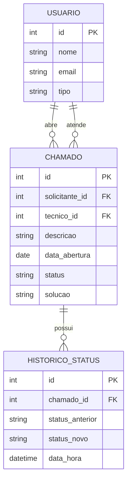

# Documento de Requisitos
## Sistema de Gestão de Chamados de TI (Helpdesk)

**Autor:** Gabriel Pacicco
**Versão:** 1.0 (rascunho inicial)
**Data:** Julho de 2026

---

## 1. Introdução e Objetivo

Este documento descreve os requisitos funcionais e não-funcionais do Sistema de Gestão de Chamados de TI, cujo objetivo é permitir que funcionários solicitem suporte técnico de forma organizada, e que a equipe de TI acompanhe e resolva essas solicitações de maneira estruturada, substituindo processos informais (e-mail, WhatsApp, papel).

> *Nota didática: essa introdução responde à pergunta "por que esse sistema existe?". Todo documento de requisitos começa contextualizando o problema antes de listar soluções.*

---

## 2. Escopo do Sistema

O sistema permitirá:
- Abertura de chamados técnicos por funcionários
- Acompanhamento do andamento e status dos chamados
- Gestão e resolução dos chamados pela equipe técnica

Está **fora do escopo** desta primeira versão: controle de estoque de peças, integração com sistemas de RH, e aplicativo mobile nativo (podem ser propostos como evoluções futuras).

> *Nota didática: definir o que o sistema NÃO vai fazer é tão importante quanto definir o que ele vai fazer — evita que o projeto "cresça" sem controle (isso se chama "escopo").*

---

## 3. Atores (quem usa o sistema)

| Ator | Descrição |
|---|---|
| **Solicitante** | Funcionário que abre um chamado pedindo ajuda técnica |
| **Técnico** | Responsável por atender, atualizar e resolver os chamados |
| **Administrador** | Gerencia usuários e configurações gerais do sistema *(pode ser o mesmo que o Técnico numa primeira versão simples)* |

---

## 4. Requisitos Funcionais

*Requisitos funcionais descrevem **o que o sistema faz** — ações concretas que o usuário consegue realizar.*

| ID | Requisito | Descrição |
|---|---|---|
| RF01 | Abrir chamado | O Solicitante deve poder abrir um novo chamado informando: nome de quem abriu, descrição do problema e data de abertura (gerada automaticamente pelo sistema) |
| RF02 | Listar chamados | O sistema deve exibir a lista de chamados abertos, com status atual de cada um |
| RF03 | Consultar status | O Solicitante deve poder consultar o status de um chamado específico (ex: Aberto, Em andamento, Resolvido) |
| RF04 | Atualizar status | O Técnico deve poder alterar o status de um chamado conforme o atendimento evolui |
| RF05 | Registrar solução | O Técnico deve poder registrar uma descrição da solução aplicada ao encerrar o chamado |
| RF06 | Histórico do chamado | O sistema deve manter um histórico com data/hora de cada mudança de status |

---

## 5. Requisitos Não-Funcionais

*Requisitos não-funcionais descrevem **como o sistema deve se comportar** — qualidade, desempenho, segurança — não uma ação específica.*

| ID | Requisito | Descrição |
|---|---|---|
| RNF01 | Usabilidade | A interface deve ser simples o suficiente para uso por funcionários sem conhecimento técnico |
| RNF02 | Desempenho | A listagem de chamados deve carregar em até 2 segundos com até 500 registros |
| RNF03 | Disponibilidade | O sistema deve estar acessível via navegador, sem necessidade de instalação |
| RNF04 | Segurança | Apenas usuários autenticados podem abrir ou visualizar chamados |

---

## 6. Dados Armazenados (visão inicial)

Baseado no que foi levantado, os principais dados que o sistema precisa guardar por chamado:

- Nome do solicitante
- Descrição do chamado
- Data de abertura
- Status (Aberto / Em andamento / Resolvido)
- Descrição da solução (preenchido ao encerrar)
- Histórico de mudanças de status

> *Nota didática: essa lista vai virar a base do "Modelo de Entidade-Relacionamento" (Modelo ER) na próxima etapa — modelagem do banco de dados.*

---

## 7. Modelagem de Dados (Modelo ER)

A partir dos dados levantados na seção 6, foram definidas 3 entidades:

**Usuário** (`id` PK, `nome`, `email`, `tipo`) — representa tanto o Solicitante quanto o Técnico, diferenciados pelo campo `tipo`.

**Chamado** (`id` PK, `solicitante_id` FK, `tecnico_id` FK, `descricao`, `data_abertura`, `status`, `solucao`) — entidade central do sistema. Referencia dois usuários: quem abriu (solicitante) e quem atende (técnico).

**Histórico de Status** (`id` PK, `chamado_id` FK, `status_anterior`, `status_novo`, `data_hora`) — registra cada mudança de status de um chamado, atendendo ao RF06.

**Relacionamentos:**
- Um Usuário pode abrir vários Chamados (1:N, como solicitante)
- Um Usuário pode atender vários Chamados (1:N, como técnico)
- Um Chamado pode ter vários registros de Histórico de Status (1:N)

> *Nota didática: separar o histórico numa tabela própria (em vez de só sobrescrever o campo status) é uma decisão comum de modelagem quando o requisito pede "acompanhar o andamento" — assim você não perde o rastro de mudanças anteriores.*

---

## 8. Glossário

- **Chamado**: solicitação de suporte técnico aberta por um funcionário
- **Status**: estado atual do chamado dentro do fluxo de atendimento
- **Solicitante**: funcionário que abriu o chamado

---

## 9. Backlog do Produto

*O backlog transforma cada requisito funcional numa "história de usuário" — uma frase no formato "Como [ator], quero [ação], para [benefício]" — priorizada e pronta para ser trabalhada em sprints.*

| ID | História de Usuário | Requisito relacionado | Prioridade |
|---|---|---|---|
| US01 | Como Solicitante, quero abrir um chamado informando meu nome e a descrição do problema, para que a TI saiba do meu problema | RF01 | Alta |
| US02 | Como Solicitante, quero ver a lista de chamados e seus status, para acompanhar o andamento | RF02, RF03 | Alta |
| US03 | Como Técnico, quero atualizar o status de um chamado, para refletir o progresso do atendimento | RF04 | Alta |
| US04 | Como Técnico, quero registrar a solução aplicada ao encerrar um chamado, para documentar o que foi feito | RF05 | Média |
| US05 | Como Solicitante, quero ver o histórico de mudanças de status de um chamado, para entender o que já aconteceu | RF06 | Média |
| US06 | Como Administrador, quero que apenas usuários autenticados acessem o sistema, para garantir segurança | RNF04 | Alta |

**Ordem sugerida de execução (sprints):**
- **Sprint 1** — US01, US02 (fluxo básico: abrir e visualizar chamados)
- **Sprint 2** — US03, US06 (atendimento técnico + autenticação)
- **Sprint 3** — US04, US05 (encerramento e histórico)

> *Nota didática: histórias de "Alta" prioridade formam o "MVP" (produto mínimo viável) — a versão mais simples do sistema que já entrega valor real. As de prioridade "Média" são refinamentos que vêm depois.*

---

## 10. Board Kanban

O board organiza visualmente as histórias do backlog em 3 colunas: **A Fazer**, **Em Andamento** e **Concluído**. No início do projeto, todas as histórias (US01-US06) começam em "A Fazer" — a ideia é movê-las de coluna conforme o trabalho avança, dando visibilidade do progresso a qualquer momento.

> *Nota didática: isso é a essência da metodologia Kanban — visualizar o fluxo de trabalho e limitar o quanto está "em andamento" ao mesmo tempo, evitando começar tudo e não terminar nada.*

Recomenda-se recriar esse board numa ferramenta real (Trello, Jira ou GitHub Projects) para ter histórico de movimentação — isso também vira evidência documentada de gestão do projeto.

---

## Próximos Passos

1. ~~Revisar este documento~~
2. ~~Modelagem: Modelo ER do banco de dados~~
3. ~~Planejamento: backlog do produto~~
4. ~~Montar o board Kanban com as histórias do backlog~~
5. Iniciar o desenvolvimento (Sprint 1: US01 e US02)

